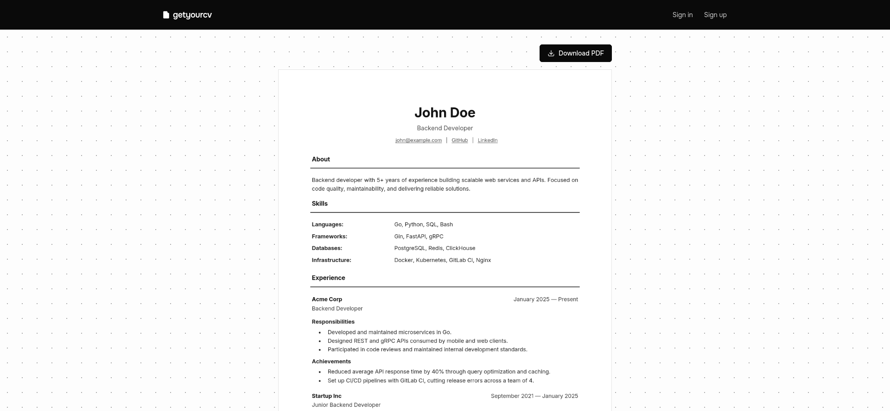

# getyourcv

getyourcv is a web service for building a resume once and publishing it at a shareable link. It targets HR all over the world: one fixed, professional template, fast loading anywhere, and no template-picking or feature clutter to get in the way.

## Table of Contents

- [Overview](#overview)
- [Features](#features)
- [Tech stack](#tech-stack)
- [Prerequisites](#prerequisites)
- [Configuration](#configuration)
- [Installation & Setup](#installation--setup)
- [Running the Application](#running-the-application)
- [Testing](#testing)
- [Deployment](#deployment)
- [How to Contribute](#how-to-contribute)

## Overview

A user fills in a single resume form, gets a live preview next to it, and publishes the result at a public page that needs no login to view.



## Features

- **Resume builder with live preview** - contacts, skills, experience, education, courses, certifications, with an instant preview next to the form.
- **Guest-first flow** - drafting a resume needs no account; sign-up is only asked for at Save.
- **One fixed template** - web, dashboard, and PDF, identical everywhere.
- **Public link** - no auth required; everybody sees the resume page with a Download PDF button.
- **Versioning** - a snapshot on every save, with view/restore/delete for past versions.
- **AI bullet rewriting** - rewrite the About section or any bullet into a shorter, stronger, or number-driven variant.
- **Vacancy matching** - paste a job description, get a match score with matched/missing skills.
- **View analytics** - per-resume view counter and a stats page, excluding the owner's own visits.
- **Google sign-in** - auto-linked to an existing account by verified email.

## Tech stack

- **Backend**: PHP 8.3+, Laravel 11
- **Auth**: Laravel Breeze (Inertia + Vue stack), Socialite for Google SSO
- **Database**: PostgreSQL
- **Frontend**: Vue 3 (Composition API), Inertia.js, Tailwind CSS, Vite
- **PDF**: [resume-gen](https://github.com/yognevoy/resume-gen) (Go binary)
- **AI**: Generic OpenAI-compatible HTTP client
- **Tests**: Pest 4

## Prerequisites

Before you begin, ensure you have met the following requirements:

- **Docker** (version 20.10 or higher)
- **Docker Compose** (version 2.0 or higher)
- **Git** (version 2.0 or higher)

## Configuration

### Environment Variables

Key environment variables in `.env`:

- `DB_HOST`, `DB_PORT`, `DB_DATABASE`, `DB_USERNAME`, `DB_PASSWORD`: PostgreSQL connection
- `AI_BASE_URL`, `AI_API_KEY`, `AI_MODEL`: Any OpenAI-compatible endpoint - swap provider/model without code changes
- `GOOGLE_CLIENT_ID`, `GOOGLE_CLIENT_SECRET`, `GOOGLE_REDIRECT_URI`: Google sign-in
- `MAIL_*`: Mail delivery (Mailpit locally)

## Installation & Setup

### 1. Clone the Repository

```bash
git clone git@github.com:yognevoy/getyourcv.git
cd getyourcv
```

### 2. Build and Start Containers

```bash
docker compose up -d --build
```

## Running the Application

### Starting Services

```bash
docker compose up -d
```

### Stopping Services

```bash
docker compose down
```

### Accessing Services

- **Web Application**: http://localhost:8000
- **Vite dev server (HMR)**: http://localhost:5173
- **Mailpit**: http://localhost:8025
- **PostgreSQL**: localhost:5432

## Testing

### Running Tests

```bash
docker compose exec app php artisan test
```

## Deployment

A self-contained production stack ships alongside the dev one, built from the same multi-stage Dockerfile.

```bash
cp .env.production.example .env.production

docker compose -f docker-compose.prod.yml --env-file .env.production up -d --build
```

## How to Contribute

If you find a bug or have a feature request, please check the [Issues page](https://github.com/yognevoy/getyourcv/issues) before creating a new one. For code contributions, fork the repository, make your changes on a new branch, and submit a pull request with a clear description of the changes. Please make sure to test your changes thoroughly before submitting.
